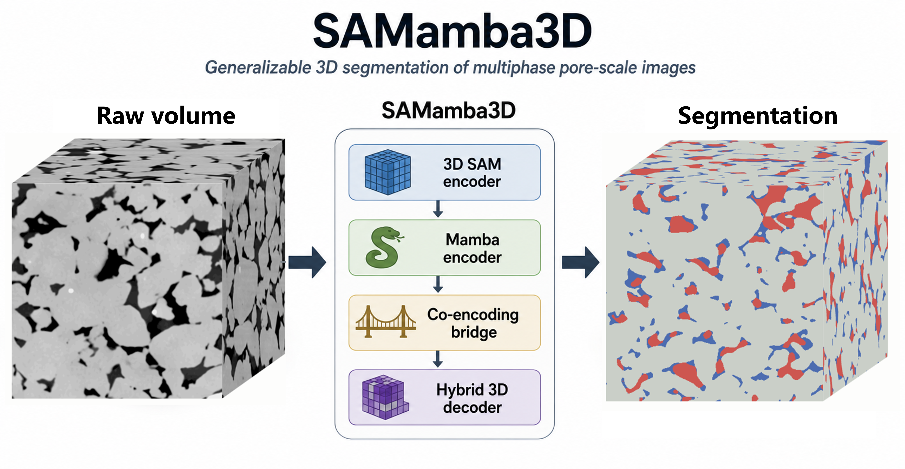
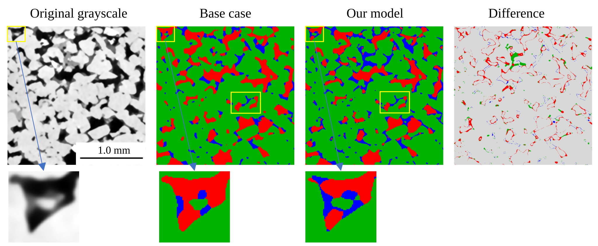
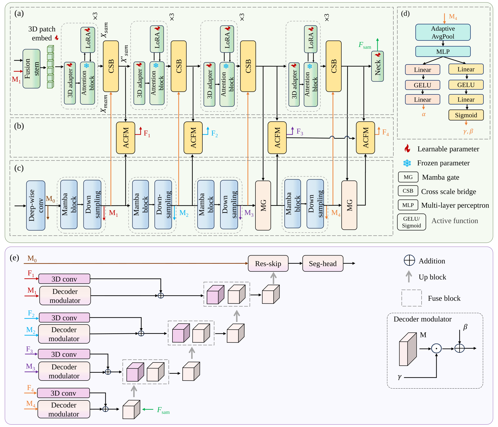

# SAMamba3D 🧠🪨

<p align="left">
  <a href="https://github.com/ImperialCollegeLondon/SAMamba-3D"></a>
  <a href="https://drive.google.com/drive/folders/1bl8ZiSdgIQokrrETux9xTsQ_MF55EPaU?usp=sharing"></a>
  
  
  
</p>

**Adapting Segment Anything for generalizable three-dimensional segmentation of multiphase pore-scale images**

SAMamba3D adapts the pretrained **Segment Anything Model (SAM)** image encoder to volumetric data by coupling it with a multi-scale **Mamba** 3D encoder, progressive cross-scale feature interaction, and a hybrid 3D decoder. It performs **automatic, prompt-free, voxel-wise 3D segmentation** of multiphase pore-scale X-ray images (e.g. oil / brine / rock), and generalizes across rock types and imaging conditions with parameter-efficient fine-tuning.


<p align="center">
  
</p>
<p align="center"><em>From raw micro-CT volume to voxel-wise oil/brine/rock segmentation, fully automatic and in 3D.</em></p>

> 📄 **Paper:** Zhang, R., Song, X., Zhu, L., Bijeljic, B., Li, G., & Blunt, M. J. (2026). *SAMamba3D: Adapting segment anything for generalizable three-dimensional segmentation of multiphase pore-scale images*. **Advances in Geo-Energy Research, 21(2), 109–124**. https://doi.org/10.46690/ager.2026.08.03
>
> 📦 **SAMamba3D model:** [SAMamba3D-turbo checkpoint (Google Drive)](https://drive.google.com/drive/folders/1bl8ZiSdgIQokrrETux9xTsQ_MF55EPaU?usp=sharing)
> 🇨🇳 **Mainland China mirror:** [SAMamba3D-turbo checkpoint (ModelScope)](https://modelscope.cn/models/LinqiZhu/SAMamba3D-turbo)

## 📑 Table of contents

- [Quick start (5 minutes)](#-quick-start-5-minutes)
- [Installation](#%EF%B8%8F-installation)
- [Model checkpoints](#-model-checkpoints)
- [Data preparation](#-data-preparation)
- [Inference](#-inference)
- [Training](#-training)
- [Python API](#-python-api)
- [Model architecture](#%EF%B8%8F-model-architecture)
- [Repository structure](#%EF%B8%8F-repository-structure)
- [Implementation notes](#-current-implementation-notes)
- [Troubleshooting](#%EF%B8%8F-troubleshooting)
- [Citation](#-citation)

---

## 🚀 Quick start (5 minutes)

Segment a volume with the pretrained **SAMamba3D-turbo** checkpoint:

```bash
# 1. Clone and install (see Installation for details)
git clone https://github.com/ImperialCollegeLondon/SAMamba-3D.git
cd SAMamba-3D
conda create -n samamba3d python=3.10 -y && conda activate samamba3d
pip install torch==2.4.1 torchvision==0.19.1 torchaudio==2.4.1 \
  --index-url https://download.pytorch.org/whl/cu124
pip install -r requirements.txt
pip install causal-conv1d mamba-ssm

# 2. Download the pretrained checkpoint
pip install gdown
mkdir -p checkpoints/samamba3d
gdown --folder "https://drive.google.com/drive/folders/1bl8ZiSdgIQokrrETux9xTsQ_MF55EPaU?usp=sharing" \
  -O checkpoints/samamba3d
```

Then point `model_inference.py` at your data (a `float32` NumPy volume of shape `[D, H, W]`) and run:

```bash
python model_inference.py
```

The script writes a predicted label volume (`*_pred.npy`), 2D slice comparisons, and 3D overview renderings to `config.result_dir`.

> ⚠️ The inference script currently requires a few one-line edits before the first run (paths, device, and removing one project-local import). See the [pre-flight checklist](#1-pre-flight-checklist) — it takes about two minutes.

---

## ⚙️ Installation

### 1. Create an environment

A CUDA-enabled Linux environment is recommended.

```bash
conda create -n samamba3d python=3.10 -y
conda activate samamba3d
```

### 2. Install PyTorch

`requirements.txt` was generated with PyTorch 2.4.1 and CUDA 12 packages. Install the PyTorch build matching your CUDA driver (example for CUDA 12.4):

```bash
pip install torch==2.4.1 torchvision==0.19.1 torchaudio==2.4.1 \
  --index-url https://download.pytorch.org/whl/cu124
```

For other CUDA versions, use the [official PyTorch installation selector](https://pytorch.org/get-started/locally/).

### 3. Install project dependencies

```bash
pip install -r requirements.txt
pip install causal-conv1d mamba-ssm   # required by mamba_encoder.py
```

If `mamba-ssm` compilation fails, check that your CUDA toolkit, PyTorch CUDA version, compiler, and GPU architecture are mutually compatible (see [Troubleshooting](#%EF%B8%8F-troubleshooting)).

### 4. Verify the environment

```bash
python - <<'PY'
import torch
import monai
print("PyTorch:", torch.__version__)
print("CUDA available:", torch.cuda.is_available())
print("MONAI:", monai.__version__)
try:
    import mamba_ssm
    print("mamba_ssm: OK")
except Exception as e:
    print("mamba_ssm import failed:", e)
PY
```

All four lines should print without errors before you continue.

---

## 📦 Model checkpoints

SAMamba3D uses **two** kinds of checkpoints — make sure you have the right one for your use case:

| You want to… | You need | Where it goes |
|---|---|---|
| **Run inference** on your own volumes | SAMamba3D-turbo (pretrained) | `checkpoints/samamba3d/` |
| **Fine-tune** on your own labels | SAMamba3D-turbo (as initialization) | `checkpoints/samamba3d/` |
| **Train from scratch** | Official SAM ViT checkpoint | `checkpoints/sam/` |

### SAMamba3D-turbo (pretrained, recommended)

```bash
pip install gdown
mkdir -p checkpoints/samamba3d
gdown --folder "https://drive.google.com/drive/folders/1bl8ZiSdgIQokrrETux9xTsQ_MF55EPaU?usp=sharing" \
  -O checkpoints/samamba3d
```

Or download manually from the [Google Drive folder](https://drive.google.com/drive/folders/1bl8ZiSdgIQokrrETux9xTsQ_MF55EPaU?usp=sharing) and place the `.pth` file under `checkpoints/samamba3d/`. The examples below assume the file is named `SAMamba3D-turbo.pth` — rename it if needed.

Loading the checkpoint:

```python
checkpoint = torch.load(
    "checkpoints/samamba3d/SAMamba3D-turbo.pth",
    map_location=device,
)
model.load_state_dict(checkpoint["model_state_dict"], strict=False)
model.eval()
```

### Official SAM initialization checkpoint (for training)

The recommended backbone is `vit_b`:

```bash
mkdir -p checkpoints/sam
wget -O checkpoints/sam/sam_vit_b_01ec64.pth \
  https://dl.fbaipublicfiles.com/segment_anything/sam_vit_b_01ec64.pth
```

| Model type | Checkpoint filename | Status |
|---|---|---|
| `vit_b` | `sam_vit_b_01ec64.pth` | ✅ Recommended default |
| `vit_l` | `sam_vit_l_0b3195.pth` | ⚠️ Architecture branch exists in `SAMamba3D.py` |
| `vit_h` | `sam_vit_h_4b8939.pth` | 🧪 Parser option only — treat as experimental |

---

## 🧪 Data preparation

### Expected input format

Training uses NumPy arrays loaded from `.npy` files:

```text
image volume:  float32 array, shape [D, H, W]
label volume:  int32/int64 array, shape [D, H, W]
```

Inference supports `.npy` and `.tif` volumes (`.npy` is the most direct path with the current code).

### Label convention

The default label convention used by the evaluation helper:

| Label | Phase |
|:---:|---|
| `0` | Unknown / background |
| `1` | Non-wetting phase |
| `2` | Wetting phase |
| `3` | Rock |

For other segmentation tasks, update `num_classes`, `label_mapping`, and the class names in `model_inference.py`. Labels must be integers in `[0, num_classes - 1]`.

### Converting a TIFF stack to `.npy`

```python
import numpy as np
import tifffile

vol = tifffile.imread("my_volume.tif").astype(np.float32)  # [D, H, W]
np.save("data/my_volume/image.npy", vol)
```

---

## 🔍 Inference

Inference is implemented in `model_inference.py` with sliding-window prediction over the full volume.

<p align="center">
  
</p>
<p align="center"><em>Slice-level comparison of raw image, base case/ ground truth, and SAMamba3D prediction.</em></p>

### 1. Pre-flight checklist

The current script contains project-specific defaults. Edit the `if __name__ == "__main__":` block and `test_model()` before the first run:

| # | What to set | Where | Example |
|---|---|---|---|
| 1 | Device | `__main__` block | `config.device = torch.device("cuda" if torch.cuda.is_available() else "cpu")` |
| 2 | Input volume | `__main__` block | `config.data_path = "data/SSa/image.npy"` |
| 3 | Labels (optional) | `__main__` block | `config.labels_path = "data/SSa/label.npy"` or `None` |
| 4 | Checkpoint | `__main__` block | `checkpoint_path = "checkpoints/samamba3d/SAMamba3D-turbo.pth"` |
| 5 | Output directory | `__main__` block | `config.result_dir = "outputs/run_samamba3d_vitb_patch96/results"` |
| 6 | Patch & stride | `__main__` block | see below |
| 7 | Remove `DomainTransfer` | `test_model()` | see below |

Patch size and stride (70% overlap):

```python
config.patch_size = (128, 128, 128)
config.stride = tuple(int(p * (1 - 0.7)) for p in config.patch_size)
```

`data_transfer.py` is **not included** in this repository. Remove or replace this block inside `test_model()`:

```python
# Remove:
from data_transfer import DomainTransfer
dt = DomainTransfer()
test_data = dt.percentile_normalization(test_data, target_data)

# Minimal replacement:
test_data = test_data.astype(np.float32)
```

### 2. Run

```bash
python model_inference.py
```

### 3. Outputs

| Output | Example |
|---|---|
| Predicted label volume | `1PV_pred.npy` |
| 2D slice comparison figure | `slice_1PV_33_comparison.png` |
| 3D overview renderings | `3Dmamba_1PV_{pred,gt,raw}.png` |
| Per-class metrics (if labels given) | Precision / Recall / Dice / IoU |
| Runtime & memory statistics | printed to console/log |

### 4. How prediction works

1. Load the full 3D volume.
2. Normalize using current volume statistics or saved training statistics (`data_stats.npy`).
3. Split into overlapping 3D patches.
4. Run `model.forward_stage1()` on each patch.
5. Apply softmax to class logits.
6. Average overlapping predictions.
7. Return `argmax` class labels with shape `[D, H, W]`.

---

## 🏋️ Training

> Training entry point: `SAM_train.py`. Run `python SAM_train.py --help` for the full argument list.

### 1. Register your datasets

Training data lists are **empty by default**. Populate them in `SAM_train.py`:

```python
dataset_img_paths   = ["data/SSa/image.npy", ...]
dataset_label_paths = ["data/SSa/label.npy", ...]
data_names          = ["SSa", ...]
```

### 2. Launch training

```bash
python SAM_train.py \
  --model_type vit_b \
  --sam_checkpoint checkpoints/sam/sam_vit_b_01ec64.pth
```

Default patch size, training schedule, paths, and random seed live in `Config.py`.

### 3. Stages

- **Stage I** (`train_stage_i()`): the implemented training path — SAM-Mamba co-encoding with LoRA/adapter tuning.
- **Fine-tuning** (`fine_tuning()`): adapt a pretrained SAMamba3D checkpoint to a new dataset.
- **Stage II**: the parser exposes `stage_ii` / `both`, but `train_stage_ii()` is **not yet implemented** — use `stage_i` or fine-tuning.

### 4. Checkpoints saved during training

```python
{
    "epoch": epoch,
    "stage": current_stage,
    "model_state_dict": model.state_dict(),
    "optimizer_state_dict": optimizer.state_dict(),
    "scheduler_state_dict": scheduler.state_dict(),
    "best_dice": best_dice,
    "config": config,
    "scaler_state_dict": scaler.state_dict(),  # when AMP is enabled
}
```

Typical output tree:

```text
outputs/
└── run_samamba3d_vitb_patch96/
    ├── checkpoints/
    │   ├── best_model.pth
    │   ├── stage_i_epoch_50.pth
    │   └── stage_i_final.pth
    ├── logs/
    │   └── train.log
    └── results/
        ├── 1PV_pred.npy
        ├── slice_1PV_33_comparison.png
        └── 3Dmamba_1PV_{pred,gt,raw}.png
```

---

## 🐍 Python API

Minimal model construction and forward pass:

```python
import torch
from SAMamba3D import SAM_Mamba_3D_CoEncoding

mamba_config = {
    "in_chans": 1,
    "depths": [2, 2, 2, 2],
    "dims": [48, 96, 192, 384],
    "drop_path_rate": 0.1,
    "out_indices": [0, 1, 2, 3],
}

model = SAM_Mamba_3D_CoEncoding(
    model_type="vit_b",
    mamba_config=mamba_config,
    num_classes=4,
    in_chans=1,
    out_chans=256,
    lora_rank=8,
    lora_alpha=16.0,
).cuda()

model.set_training_stage("A", sam_checkpoint="checkpoints/sam/sam_vit_b_01ec64.pth")

x = torch.randn(1, 1, 96, 96, 96).cuda()  # [B, C, D, H, W]
logits = model.forward_stage1(x)           # [B, num_classes, D, H, W]
print(logits.shape)
```

Training-mode forward pass returns additional intermediate outputs:

```python
outputs = model.forward_stage1(x, training=True)
print(outputs.keys())
```

---

## 🏗️ Model architecture

<p align="center">
  
</p>
<p align="center"><em>SAMamba3D couples a 3D-adapted SAM ViT stream with a multi-scale 3D Mamba stream through cross-scale adapters, bidirectional bridges, and DACFM fusion, then decodes with a hybrid 3D decoder.</em></p>

<details>
<summary><b>Text version of the data flow</b> (click to expand)</summary>

```text
Input volume [B, 1, D, H, W]
        │
        ├── MambaEncoder
        │      ├── scale0: [B,  48, D/2,  H/2,  W/2]
        │      ├── scale1: [B,  96, D/4,  H/4,  W/4]
        │      ├── scale2: [B, 192, D/8,  H/8,  W/8]
        │      └── scale3: [B, 384, D/16, H/16, W/16]
        │
        ├── EarlyFusionStem + 3D PatchEmbed
        │      └── SAM-style 3D tokens
        │
        ├── CoEncodingEncoder
        │      ├── 3D SAM ViT blocks
        │      ├── LoRA bypasses
        │      ├── shallow Mamba → SAM cross-scale adapters
        │      ├── deep bidirectional SAM ↔ Mamba bridges
        │      ├── Mamba global controller
        │      └── DACFM feature fusion nodes
        │
        └── HybridCoDecoder
               ├── SAM neck features
               ├── Mamba skip features
               ├── FiLM modulation
               ├── intermediate co-encoded features
               ├── high-resolution skip
               └── voxel logits [B, num_classes, D, H, W]
```

</details>

### Where to find each component in the code

| Component | File | Purpose |
|---|---|---|
| `ImageEncoderViT_3d` | `AdapterSAM/image_encoder_3d.py` | 3D adaptation of SAM ViT blocks with 3D window attention |
| `MambaEncoder` | `mamba_encoder.py` | Multi-scale volumetric context encoder |
| `SAMBlockLoRABypass` | `SAMamba3D.py` | Lightweight LoRA residual path around SAM blocks |
| `CrossScaleAdapter` | `SAMamba3D.py` | Injects aligned Mamba features into SAM token space |
| `BidirectionalBridge` | `SAMamba3D.py` | Mamba → SAM and optional SAM → Mamba interaction |
| `MambaGlobalController` | `SAMamba3D.py` | Produces routing scores, injection strengths, and FiLM parameters |
| `DACFM` | `SAMamba3D.py` | Dynamic attention-based cross-feature fusion module |
| `HybridCoDecoder_v5` | `SAMamba3D.py` | Reconstructs full-resolution segmentation logits |
| `RockCoreLoss` | `Compoundloss.py` | Composite loss for pore-scale phase segmentation |


## 🗂️ Repository structure

```text
SAMamba-3D/
├── AdapterSAM/
│   └── image_encoder_3d.py        # 3D SAM-style ViT encoder, 3D adapters, 3D window attention
├── SAMamba3D.py                   # Model: SAM-Mamba co-encoding + hybrid decoder
├── mamba_encoder.py               # 3D Mamba encoder
├── SAM_train.py                   # Training entry point
├── model_inference.py             # Sliding-window inference and evaluation
├── Combined_dataloader.py         # Volume loading, patch sampling, augmentation, normalization
├── Compoundloss.py                # Focal, boundary, Tversky, enhanced, and RockCore losses
├── Config.py                      # Default patch, training, path, and seed configuration
├── early_stopping.py              # Early stopping utility
├── image_slice_view.py            # 2D slice and 3D overview visualization helpers
├── memory_cal.py                  # GPU/CPU memory measurement utilities
├── requirements.txt               # Python dependencies
├── LICENSE                        # Apache-2.0
└── README.md
```
---

## 📝 Current implementation notes

The repository is research code and contains project-specific defaults. Check these before running on a new machine:

1. **Training data lists are empty by default** — populate `dataset_img_paths`, `dataset_label_paths`, and `data_names` in `SAM_train.py`.
2. **Inference requires `config.device`** — add `config.device = torch.device(...)` in `model_inference.py` before calling `test_model()`.
3. **`vit_b` is the safest default** — `vit_l` has an architecture branch; treat `vit_h` as experimental.
4. **`mamba_ssm` must be installed separately** — it is imported by `mamba_encoder.py`.

---

## 🛠️ Troubleshooting

<details>
<summary><b><code>ModuleNotFoundError: No module named 'mamba_ssm'</code></b></summary>

```bash
pip install causal-conv1d mamba-ssm
```

If compilation fails, align PyTorch, CUDA toolkit, GCC, and GPU architecture versions.

</details>

<details>
<summary><b><code>SAM checkpoint not found</code></b></summary>

Check that `--sam_checkpoint` points to an existing `.pth` file:

```bash
ls checkpoints/sam/sam_vit_b_01ec64.pth
```

</details>

<details>
<summary><b>CUDA out of memory</b></summary>

Use a smaller patch size in `Config.py`:

```python
patch_size = (64, 64, 64)
stride = tuple(int(p * (1 - 0.5)) for p in patch_size)
```

Also reduce `batch_size` to `1`, keep AMP enabled unless it causes numerical issues, and avoid large validation patch counts.

</details>

<details>
<summary><b>Label index out of range</b></summary>

Ensure labels are integers in `[0, num_classes - 1]`. If your dataset uses arbitrary values, define `label_mapping` before calling `data_loaders()`.

</details>

---

## 📚 Citation

If you use this code or model in your research, please cite:

```bibtex
@article{zhang2026samamba3d,
  title   = {SAMamba3D: Adapting segment anything for generalizable three-dimensional segmentation of multiphase pore-scale images},
  author  = {Zhang, Rui and Song, Xianzhi and Zhu, Linqi and Bijeljic, Branko and Li, Gensheng and Blunt, Martin J.},
  journal = {Advances in Geo-Energy Research},
  volume  = {21},
  number  = {2},
  pages   = {109--124},
  year    = {2026},
  doi     = {10.46690/ager.2026.08.03}
}
```

---

## 📄 License

This repository is released under the Apache License 2.0 — see [LICENSE](LICENSE).

The SAM pretrained checkpoints are distributed by the Segment Anything project; check the original SAM repository for its model and dataset license terms.

---

## 🙏 Acknowledgements

This project builds on ideas and software from:

- [Segment Anything](https://github.com/facebookresearch/segment-anything)
- [MONAI](https://monai.io/)
- [Mamba SSM](https://github.com/state-spaces/mamba)
- PyTorch, NumPy, SciPy, scikit-image, SimpleITK, and related scientific Python libraries
